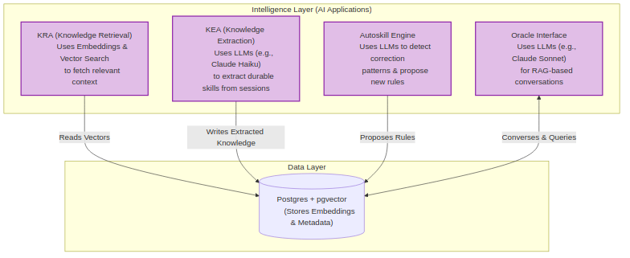

# External Brain: Self-Improving, Self-Hosted AI Coding Memory Across Every Tool, Project, and Team

> **Your AI's memory is trapped in one tool, one project, one person.** Claude
> Code doesn't share with Cursor, a lesson learned on one repo doesn't carry to
> the next, and your teammates each start from zero. External Brain is **one
> shared, self-hosted knowledge layer across every MCP tool, project, and team**.
> A skill learned once applies everywhere it's relevant, you can inspect and edit
> what it knows, and answers cite your own work. Best of all, it improves on its
> own: after each session it proposes new skills from what you did, so every
> project gets sharper without anyone hand-writing rules. Built for teams and
> enterprise, on your own infrastructure.


<p>
  <a href="https://github.com/bejranonda/ExternalBrain/actions/workflows/ci.yml"></a>
  <a href="https://github.com/bejranonda/ExternalBrain/stargazers"></a>
  <a href="https://github.com/bejranonda/ExternalBrain/network/members"></a>
  <a href="https://github.com/bejranonda/ExternalBrain/issues"></a>
  <a href="./LICENSE"></a>
  
  
  
</p>

**External Brain** is a self-hosted **MCP (Model Context Protocol) server +
webapp** that gives AI coding agents persistent, long-term memory. It ingests
your coding sessions, **extracts durable knowledge** (skills, rules, recipes,
anti-patterns), **retrieves it by semantic meaning** when you start a new task,
and answers questions about your own codebase through a grounded **Oracle** —
every answer cited back to the sessions and skills that support it.

Unlike the memory built into each AI tool, that store is **one shared,
inspectable layer across every MCP client** — it stays on your own
infrastructure instead of sitting in a separate black box locked inside each
tool.

Provider-agnostic (Google Gemini, GLM, OpenAI, Anthropic Claude), runs on a
single VM with Docker Compose, and **MIT-licensed** — fork it and build your
own.



---

## Why Use External Brain? — One Memory Across Every Tool, Project, and Team

Modern AI coding tools have memory now. The real problem is *where* that memory
lives and *how far it reaches*:

- **Siloed — per tool, per project, per person.** Claude Code doesn't share with
  Cursor or Copilot; a lesson learned on one repo doesn't carry to the next; and
  your teammates each start from zero. Knowledge that should compound stays stuck
  in one place.
- **A black box.** You can't see what it kept, fix it when it's wrong, or curate
  it. You just hope it remembered the right thing.
- **Not yours.** It's locked inside one vendor's cloud, tied to that one tool.
  You can't inspect it, move it, or share it on your terms.

External Brain is the missing **knowledge layer that spans every AI coding tool,
every project, and your whole team**: one shared, inspectable, self-hosted store
you actually own. A rule captured once ("we use Zod not Yup", "the deploy breaks
if you skip the migration step", "this service owns auth") is served back to
every tool, on every project, for every teammate who needs it. With user /
project / team / org scopes, it was built for **enterprise knowledge reuse**, so
the lessons one engineer learns become the team's, not a silo's.

And it doesn't sit still. **Autoskill** watches your sessions, proposes new skills
it notices you reusing, reinforces the rules that pay off, and lets the weak ones
fade. Each project gets better day by day, on its own, without anyone stopping to
hand-write a rules file.

### Key Features

- 🧠 **Automatic knowledge extraction** — finished sessions are mined for
  durable, reusable lessons. No manual note-taking.
- 🔌 **Universal MCP compatibility** — works with Claude Code, Cursor,
  Windsurf, Google Antigravity, GitHub Copilot (VS Code, JetBrains, CLI), and
  any MCP-capable agent as first-class clients.
- 🔎 **Semantic retrieval with pgvector** — relevant skills are injected into
  context *before* the model generates, by meaning, not keyword match.
- 💬 **Grounded Oracle with citations** — ask "how did we fix the deploy bug?"
  in plain English and get an answer cited to real sessions and skills.
- 📝 **Meeting transcript → decisions & action items** — paste a transcript
  and review/confirm the decisions, owned action items, and open questions
  it surfaced. Flag-gated (`MEETING_UPLOAD_ENABLED`), off by default.
- 📈 **Self-improving knowledge base** — a daily pipeline synthesizes
  cross-session knowledge; low-value skills decay; useful ones surface; and
  post-session **proposals** suggest new rules, increasingly tuned to what you
  accept vs reject. The brain gets sharper the more you use it.
- 🏠 **Self-hosted & private** — your knowledge stays in your Postgres, on your
  infrastructure. Secure-by-default auth, Bearer-gated MCP.
- 👥 **Team & enterprise knowledge sharing** — user / project / team / org scopes
  mean a skill learned once is reused across other projects and teammates, with
  team-wide access to the same decisions. Built for enterprise knowledge reuse,
  not one-person silos.
- 🪶 **Clean, progressive-disclosure UI** — a quiet dashboard that opens into
  depth only when you ask. Not a wall of dials.
- 🧭 **Self-explaining with built-in docs** — a built-in `/docs` glossary
  (every concept in plain English, EN/TH/DE), inline tooltips on jargon, and an
  in-app cheat-sheet of the exact prompts to type to your agent.
- 🌐 **Multilingual UI** — English, Thai (ไทย), and German, switchable on every
  surface including unauthenticated pages.

> **What it is *not*:** another AI coding tool. External Brain doesn't write
> code — it's the memory substrate that makes whatever tool you already use
> smarter over time.

---

## Quickstart — Self-Host External Brain in Minutes

Requires Docker Engine 24+ and one LLM provider key (Google Gemini has a free
tier and is the easiest start). Full guide: **[docs/QUICKSTART.md](./docs/QUICKSTART.md)**.

```bash
git clone https://github.com/bejranonda/ExternalBrain.git external-brain
cd external-brain

cp .env.example .env          # add one provider key (e.g. GOOGLE_GEMINI_API_KEY)
./scripts/dev-up.sh           # build · migrate · seed · start — idempotent
```

*Alternatively, run directly via Docker Compose:*
```bash
docker compose -f deploy/docker-compose.yml up -d
```

Webapp: `http://localhost:3000` | MCP HTTP: `http://localhost:3100/mcp`

`dev-up.sh` runs an auth-posture audit at the end and prints PASS/FAIL. For a
public-internet **server** deployment (Caddy + auto-TLS, real auth enforced,
nightly backups), use `./scripts/deploy.sh` instead — see
[docs/DEPLOY_CHECKLIST.md](./docs/DEPLOY_CHECKLIST.md).

### Sign in & create your workspace

New users can self-register from **`/signin` → "Create one"** (email + password)
and get their own personal workspace immediately. Registration is
secure-by-default: it requires a voucher code (minted by the operator at
`/admin`) unless you set `REGISTRATION_REQUIRES_VOUCHER=false` to open signup
fully. Any signed-in user can also create additional organizations from
**Settings → Organization → New organization**. See
[docs/SECURITY.md](./docs/SECURITY.md) for the full posture.

### Connect your AI tool

After signing in, the **`/welcome`** flow walks you through it: pick your tool,
copy a one-line installer, run any task. For Claude Code:

```bash
curl -fsSL https://<your-host>/api/onboard.sh | bash -s 'bp_<your-token>'
```

The installer wires the MCP server, smoke-tests the round-trip, and seeds your
first session so the brain starts learning from day zero. Manual wiring for
Cursor / Windsurf / Antigravity / GitHub Copilot / any MCP client:
[docs/CLIENTS.md](./docs/CLIENTS.md).

Once connected, the dashboard's **"Talk to your Brain"** card and the in-app
**[Using Brain from your agent](./docs/USING_BRAIN.md)** page give you the literal
prompts to drive it day-to-day ("create a project for this workspace", "transfer
what we learned into the Brain") — each mapped to the `brain_*` tool it triggers.

---

## How External Brain Works — MCP Knowledge Pipeline

```
  AI coding tool ──MCP──▶  External Brain  ──▶  Postgres + pgvector
   (Claude Code,            ├─ retrieve relevant skills (before you code)
    Cursor, …)              ├─ log the session + outcome (after you code)
                            ├─ extract durable knowledge (background worker)
                            └─ answer questions via the Oracle (cited)
```

1. **Before a task**, opening a session (`brain_start_session` with the task
   description) returns `relevantKnowledge` — past skills scored against the
   task, injected in the same round-trip. (`brain_retrieve_knowledge` remains
   for mid-task re-query.)
2. **After a task**, the session + outcome are reported and queued for
   extraction.
3. **A background worker** mines sessions into typed skills, embeds them for
   semantic search, and decays the stale ones.
4. **Anytime**, ask the **Oracle** in plain language and get grounded, cited
   answers from your own knowledge.
5. **Meetings too (V2.0):** feed a transcript through the
   [meeting-miner protocol](./docs/protocols/meeting-miner.md) (agentic) or
   paste it straight into the `/meetings` webapp surface (no agent required
   — flag-gated `MEETING_UPLOAD_ENABLED`, off by default) and decisions
   (with supersession), per-person action items, and open questions land in
   the same knowledge loop. Assignees see their open items at session start;
   the Oracle answers "what's open / blocked / unanswered?" from a complete
   task list. Surfacing is behind `V2_ACTION_ITEMS` / `V2_ORACLE_TASKS` flags
   — default off for a fresh self-host, so `git clone` still gives you plain
   V1 behavior; opt in by setting both `="true"`.

Full walkthrough with examples: **[docs/HOW_IT_WORKS.md](./docs/HOW_IT_WORKS.md)**.

---

## Tech Stack — What Powers External Brain

| Concern | Choice |
|---|---|
| Runtime | Node 20 LTS · TypeScript (strict) |
| Webapp | Next.js · React · Tailwind |
| Database | Postgres + pgvector |
| Embeddings | Provider-agnostic via `EMBEDDING_BASE_URL` (Gemini / OpenAI / Qwen3 — any OpenAI-compatible endpoint) |
| LLM | Claude / GLM / OpenAI / Gemini (swap via env) |
| Background jobs | pg-boss (no Redis required) |
| Protocol | Model Context Protocol (`@modelcontextprotocol/sdk`) |
| Packaging | Turborepo + pnpm workspaces · Docker Compose |

---

## Repository Structure

```
apps/
  web/         Next.js webapp — dashboard, Oracle, Skills, settings
  mcp-server/  MCP server (stdio + HTTP transport)
  worker/      Background jobs: extraction, decay, embeddings
packages/
  core/        Intelligence layer (extraction, retrieval, Oracle)
  db/          Prisma schema + client
  types/       Cross-package TypeScript types
deploy/        Docker Compose, Caddy, Dockerfile
docs/          Documentation
REBUILD/       Phase-by-phase vibe-coding reconstruction guide (start: REBUILD/00-START-HERE.md)
```

---

## Documentation & Guides

| Doc | What it covers |
|---|---|
| [EVIDENCE](./docs/EVIDENCE.md) | **Does it actually help?** — the capture→retrieve loop demonstrated on a real instance |
| [QUICKSTART](./docs/QUICKSTART.md) | Zero to a running instance |
| [tutorials/](./docs/tutorials/README.md) | End-user tutorials 01–07: getting started → Oracle → teaching → tokens → exporting → troubleshooting → skill types for non-tech readers |
| [HOW_IT_WORKS](./docs/HOW_IT_WORKS.md) | End-to-end mental model with examples |
| [ARCHITECTURE](./docs/ARCHITECTURE.md) | System design, layers, data flow |
| [MCP_TOOLS](./docs/MCP_TOOLS.md) | The `brain_*` MCP tools + resources |
| [REST_API](./docs/REST_API.md) | HTTP endpoints |
| [CLIENTS](./docs/CLIENTS.md) | Wiring Claude Code / Cursor / Windsurf / Antigravity / GitHub Copilot |
| [USING_BRAIN](./docs/USING_BRAIN.md) | Daily workflow, trigger phrases, recipes |
| [KNOWLEDGE](./docs/KNOWLEDGE.md) | The knowledge model (normative) |
| [protocols/](./docs/protocols/meeting-miner.md) | Agent protocols (V2.0): meeting-miner · doc-harvest · doc-draft · report-draft |
| [VALIDATION](./docs/VALIDATION.md) | **Does it measurably help?** — first published number (2026-07-06): retrieval NDCG@5 0.45 vs 0.30 cosine baseline on a real corpus; generation-uplift still pending, honestly tracked |
| [SECURITY](./docs/SECURITY.md) | Auth modes, MCP gating, threat model |
| [DEPLOY_CHECKLIST](./docs/DEPLOY_CHECKLIST.md) | Production deploy on a public VM |
| [CICD](./docs/CICD.md) | CI checks + the two deploy scripts, for forkers |
| [CONTRIBUTING](./docs/CONTRIBUTING.md) · [GUIDELINES](./docs/GUIDELINES.md) | How to contribute, code style |
| [DESIGN_PRINCIPLES](./docs/DESIGN_PRINCIPLES.md) | UI philosophy (progressive disclosure) |
| [KNOWN_ISSUES](./docs/KNOWN_ISSUES.md) | Tracked risks & gotchas |
| [REBUILD](./REBUILD/00-START-HERE.md) | **Rebuild from scratch** — 6-phase vibe-coding guide for porting to a new machine |

Diagrams (Mermaid sources + rendered PNGs) live in
[`docs/assets/illustrations/`](./docs/assets/illustrations/).

---

## Contributing to External Brain

Contributions and forks are welcome. Fork the repo, branch from `main`
(`feature/<slug>`, `bugfix/<slug>`, `docs/<slug>`), and open a PR — see
[docs/CONTRIBUTING.md](./docs/CONTRIBUTING.md) and [AGENTS.md](./AGENTS.md)
(the guide for AI assistants working in this repo). Be kind — we follow a
[Code of Conduct](./CODE_OF_CONDUCT.md).

Every PR runs three required checks — **typecheck · test · build** (which
includes the fresh-DB migration gate, the day-zero deploy path), an
**anonymous e2e** gate, and a **signed-in e2e** gate (both path-scoped: they
no-op green when a PR doesn't touch their surfaces). A daily **prod-drift
watchdog** flags when `main` is ahead of the deployment. How CI and the two
deploy scripts fit together is one short page:
**[docs/CICD.md](./docs/CICD.md)**.

## Frequently Asked Questions

<details>
<summary><strong>What is an MCP server and why does External Brain use one?</strong></summary>

The **Model Context Protocol (MCP)** is an open standard that lets AI coding
tools (Claude Code, Cursor, Windsurf, GitHub Copilot, etc.) connect to external
services via a structured API. External Brain runs as an MCP server so any
MCP-compatible AI tool can read and write knowledge without custom integration
work — one server, every client.
</details>

<details>
<summary><strong>Which AI coding tools does External Brain work with?</strong></summary>

Any tool that supports the Model Context Protocol: **Claude Code**, **Cursor**,
**Windsurf**, **GitHub Copilot** (VS Code, JetBrains, CLI), **Google
Antigravity**, **Gemini CLI**, and any other MCP-capable agent. See
[docs/CLIENTS.md](./docs/CLIENTS.md) for wiring instructions.
</details>

<details>
<summary><strong>How do I self-host External Brain?</strong></summary>

You need Docker Engine 24+ and one LLM provider API key (Google Gemini's free
tier works). Clone the repo, copy `.env.example` to `.env`, add your key, and
run `./scripts/dev-up.sh`. Full walkthrough:
[docs/QUICKSTART.md](./docs/QUICKSTART.md).
</details>

<details>
<summary><strong>What LLM providers are supported?</strong></summary>

External Brain is provider-agnostic. It supports **Google Gemini**, **Anthropic
Claude**, **OpenAI**, **GLM (Z.ai)**, and any OpenAI-compatible endpoint for
embeddings. Swap providers by changing environment variables — no code changes.
</details>

<details>
<summary><strong>Is my data private? Where is knowledge stored?</strong></summary>

Yes — External Brain is fully self-hosted. All knowledge, sessions, and
embeddings live in **your own Postgres + pgvector** database on your
infrastructure. Nothing is sent to third parties beyond the LLM API calls you
configure. See [docs/SECURITY.md](./docs/SECURITY.md).
</details>

<details>
<summary><strong>Why not just use the memory built into Claude Code or Cursor?</strong></summary>

Those built-in memories are **siloed three ways: per tool, per project, and per
person**. Claude Code's memory doesn't carry over to Cursor or Copilot, a lesson
learned on one repo doesn't reach the next, and each teammate starts from zero.
They're also a **black box** you can't browse or correct, and they live in
someone else's cloud. External Brain is **one shared, inspectable, self-hosted
knowledge layer across every MCP tool, project, and team**: browse and edit it in
the Skills view, get grounded Oracle answers cited to your real sessions, and own
it in your own Postgres. With user / project / team / org scopes it's built for
enterprise knowledge reuse. Use it *alongside* your tools' built-in memory, not
instead of them.
</details>

<details>
<summary><strong>Does knowledge carry across projects and teammates?</strong></summary>

Yes — that's the point. Built-in memory is stuck on one machine for one person on
one project. External Brain has **user / project / team / org scopes**: a rule
learned on one repo can apply to the next, and **team/org-scoped knowledge and
decisions are shared across everyone on the team** — a teammate's next session
surfaces them automatically. It's designed for **enterprise knowledge reuse**, so
the lessons one engineer learns become the team's, not a silo's. (Scope
boundaries are strict and owner-checked; see [docs/KNOWLEDGE.md](./docs/KNOWLEDGE.md).)
</details>

<details>
<summary><strong>Does External Brain improve on its own?</strong></summary>

Yes. After every session, **autoskill** scans what happened, proposes new skills
it notices you reusing, and reinforces the rules that pay off while letting unused
ones decay. You review proposals with one click (or auto-accept the high-confidence
ones). Each project gets sharper day by day without you stopping to hand-write a
rules file, and a new project never starts from zero. Approval is required by
default, so nothing changes your skills without you.
</details>

<details>
<summary><strong>How is External Brain different from RAG or a vector database?</strong></summary>

RAG retrieves static documents. External Brain **actively extracts, scores, and
evolves knowledge** from your coding sessions — skills decay if unused, improve
if applied successfully, and compound across teammates. It's a living knowledge
base, not a document index.
</details>

---

## License

[MIT](./LICENSE) © External Brain contributors. Fork it, run it, build on it.
