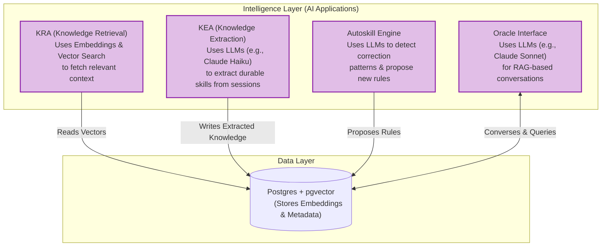

# How AI is Applied in External Brain

```mermaid
flowchart TD
    subgraph Intelligence["Intelligence Layer (AI Applications)"]
        direction TB
        KRA["KRA (Knowledge Retrieval)
        Uses Embeddings & Vector Search
        to fetch relevant context"]
        
        KEA["KEA (Knowledge Extraction)
        Uses LLMs (e.g., Claude Haiku)
        to extract durable skills from sessions"]
        
        Oracle["Oracle Interface
        Uses LLMs (e.g., Claude Sonnet)
        for RAG-based conversations"]
        
        Autoskill["Autoskill Engine
        Uses LLMs to detect correction
        patterns & propose new rules"]
    end
    
    subgraph Data["Data Layer"]
        DB[("Postgres + pgvector
        (Stores Embeddings & Metadata)")]
    end
    
    KRA -->|Reads Vectors| DB
    KEA -->|Writes Extracted Knowledge| DB
    Autoskill -->|Proposes Rules| DB
    Oracle <-->|Converses & Queries| DB

    classDef ai fill:#e1bee7,stroke:#8e24aa,stroke-width:2px;
    class KRA,KEA,Oracle,Autoskill ai;
```
