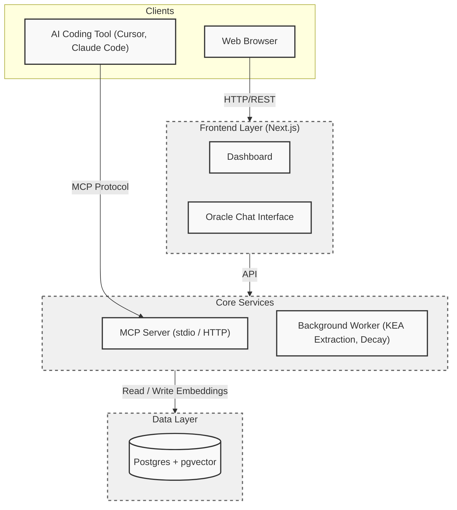

# External Brain Architecture

```mermaid
flowchart TB
    subgraph Clients
        C1["AI Coding Tool (Cursor, Claude Code)"]
        C2["Web Browser"]
    end

    subgraph Frontend["Frontend Layer (Next.js)"]
        W1["Dashboard"]
        W2["Oracle Chat Interface"]
    end

    subgraph Core["Core Services"]
        M1["MCP Server (stdio / HTTP)"]
        W3["Background Worker (KEA Extraction, Decay)"]
    end

    subgraph Database["Data Layer"]
        DB1[("Postgres + pgvector")]
    end

    C1 -- "MCP Protocol" --> M1
    C2 -- "HTTP/REST" --> Frontend
    Frontend -- "API" --> Core
    Core -- "Read / Write Embeddings" --> Database

    classDef default fill:#f9f9f9,stroke:#333,stroke-width:2px;
    classDef layer fill:#f0f0f0,stroke:#666,stroke-width:2px,stroke-dasharray: 5 5;
    class Frontend,Core,Database layer;
```
