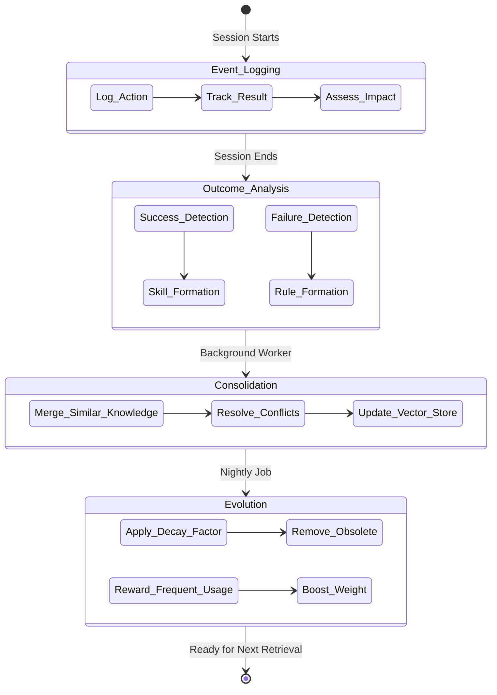

# Algorithm to Develop Knowledge

```mermaid
stateDiagram-v2
    [*] --> Event_Logging: Session Starts
    
    state Event_Logging {
        direction LR
        Log_Action --> Track_Result
        Track_Result --> Assess_Impact
    }
    
    Event_Logging --> Outcome_Analysis: Session Ends
    
    state Outcome_Analysis {
        direction TB
        Success_Detection --> Skill_Formation
        Failure_Detection --> Rule_Formation
    }
    
    Outcome_Analysis --> Consolidation: Background Worker
    
    state Consolidation {
        direction LR
        Merge_Similar_Knowledge --> Resolve_Conflicts
        Resolve_Conflicts --> Update_Vector_Store
    }
    
    Consolidation --> Evolution: Nightly Job
    
    state Evolution {
        direction LR
        Apply_Decay_Factor --> Remove_Obsolete
        Reward_Frequent_Usage --> Boost_Weight
    }
    
    Evolution --> [*]: Ready for Next Retrieval
```
