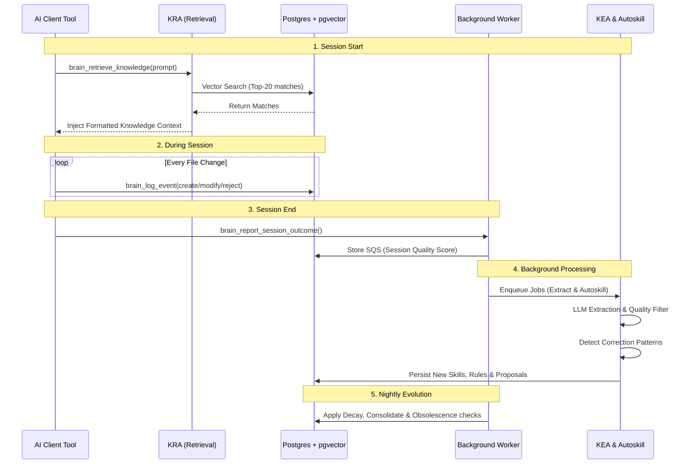

# Process, Logics & Algorithms inside External Brain

```mermaid
sequenceDiagram
    participant C as AI Client Tool
    participant KRA as KRA (Retrieval)
    participant DB as Postgres + pgvector
    participant Worker as Background Worker
    participant KEA as KEA & Autoskill

    Note over C,KEA: 1. Session Start
    C->>KRA: brain_retrieve_knowledge(prompt)
    KRA->>DB: Vector Search (Top-20 matches)
    DB-->>KRA: Return Matches
    KRA-->>C: Inject Formatted Knowledge Context

    Note over C,DB: 2. During Session
    loop Every File Change
        C->>DB: brain_log_event(create/modify/reject)
    end

    Note over C,Worker: 3. Session End
    C->>Worker: brain_report_session_outcome()
    Worker->>DB: Store SQS (Session Quality Score)
    
    Note over Worker,KEA: 4. Background Processing
    Worker->>KEA: Enqueue Jobs (Extract & Autoskill)
    KEA->>KEA: LLM Extraction & Quality Filter
    KEA->>KEA: Detect Correction Patterns
    KEA->>DB: Persist New Skills, Rules & Proposals

    Note over Worker,DB: 5. Nightly Evolution
    Worker->>DB: Apply Decay, Consolidate & Obsolescence checks
```
