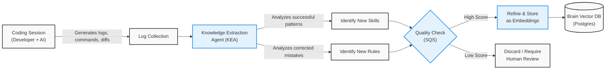

# How Brain Platform Develops Skills and Knowledge

```mermaid
flowchart LR
    A["Coding Session\n(Developer + AI)"] -->|"Generates logs, commands, diffs"| B["Log Collection"]
    B --> C["Knowledge Extraction\nAgent (KEA)"]
    
    C -->|"Analyzes successful patterns"| D["Identify New Skills"]
    C -->|"Analyzes corrected mistakes"| E["Identify New Rules"]
    
    D --> F{"Quality Check\n(SQS)"}
    E --> F
    
    F -->|"High Score"| G["Refine & Store\nas Embeddings"]
    F -->|"Low Score"| H["Discard / Require\nHuman Review"]
    
    G --> I[("Brain Vector DB\n(Postgres)")]
    
    classDef default fill:#f9f9f9,stroke:#333,stroke-width:2px;
    classDef core fill:#e3f2fd,stroke:#1e88e5,stroke-width:2px;
    class C,F,G core;
```
