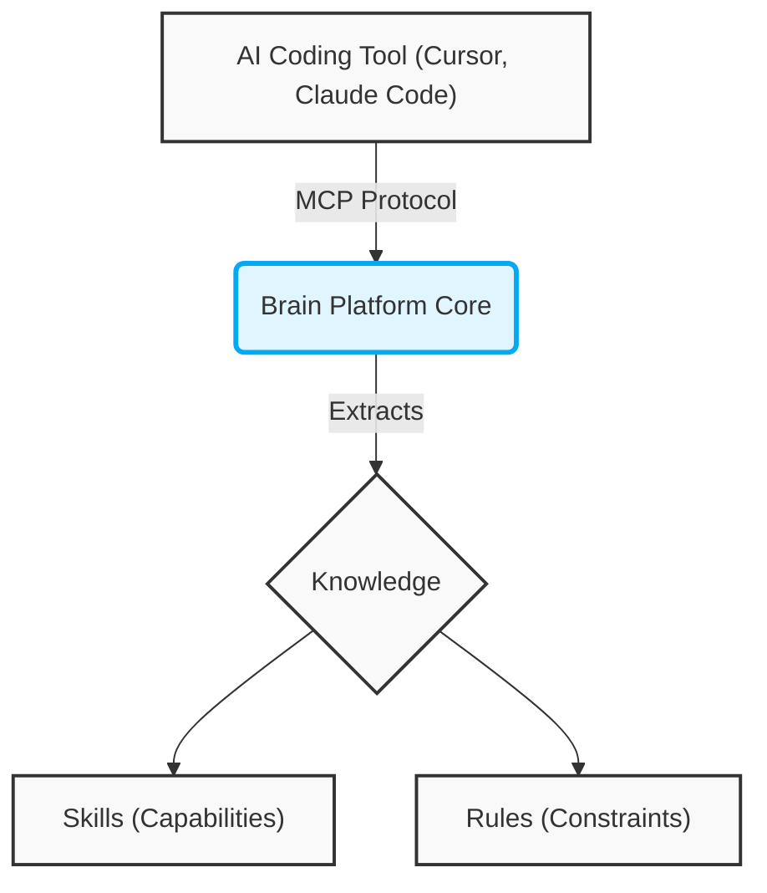

# Brain Platform User Flow

```mermaid
flowchart TD
    A["AI Coding Tool (Cursor, Claude Code)"] -- MCP Protocol --> B("Brain Platform Core")
    B -- Extracts --> C{"Knowledge"}
    C --> D["Skills (Capabilities)"]
    C --> E["Rules (Constraints)"]
    
    classDef default fill:#f9f9f9,stroke:#333,stroke-width:2px;
    classDef core fill:#e1f5fe,stroke:#03a9f4,stroke-width:3px;
    class B core;
```
