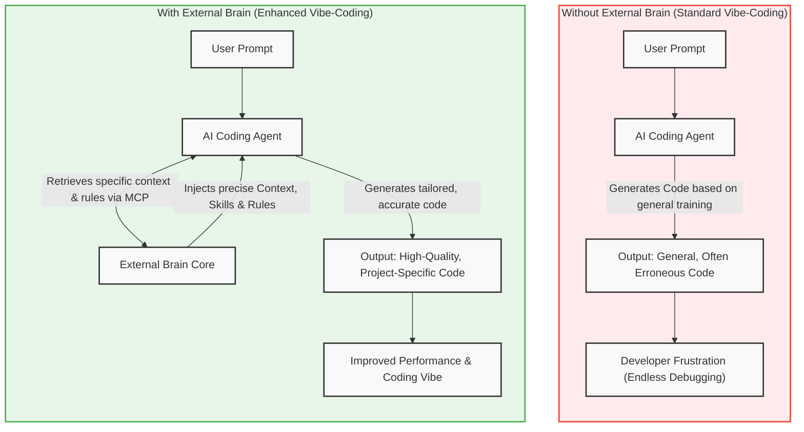

# How External Brain Improves Vibe-Coding Quality and Performance

```mermaid
flowchart TD
    subgraph Without_Brain["Without External Brain (Standard Vibe-Coding)"]
        direction TB
        P1["User Prompt"] --> AI1["AI Coding Agent"]
        AI1 --> |Generates Code based on general training| O1["Output: General, Often Erroneous Code"]
        O1 --> F1["Developer Frustration (Endless Debugging)"]
    end

    subgraph With_Brain["With External Brain (Enhanced Vibe-Coding)"]
        direction TB
        P2["User Prompt"] --> AI2["AI Coding Agent"]
        AI2 <--> |"Retrieves specific context & rules via MCP"| B["External Brain Core"]
        B --> |"Injects precise Context, Skills & Rules"| AI2
        AI2 --> |Generates tailored, accurate code| O2["Output: High-Quality, Project-Specific Code"]
        O2 --> S2["Improved Performance & Coding Vibe"]
    end
    
    classDef default fill:#f9f9f9,stroke:#333,stroke-width:2px;
    classDef highlight fill:#e8f5e9,stroke:#4caf50,stroke-width:2px;
    classDef bad fill:#ffebee,stroke:#f44336,stroke-width:2px;
    
    class With_Brain highlight;
    class Without_Brain bad;
```
