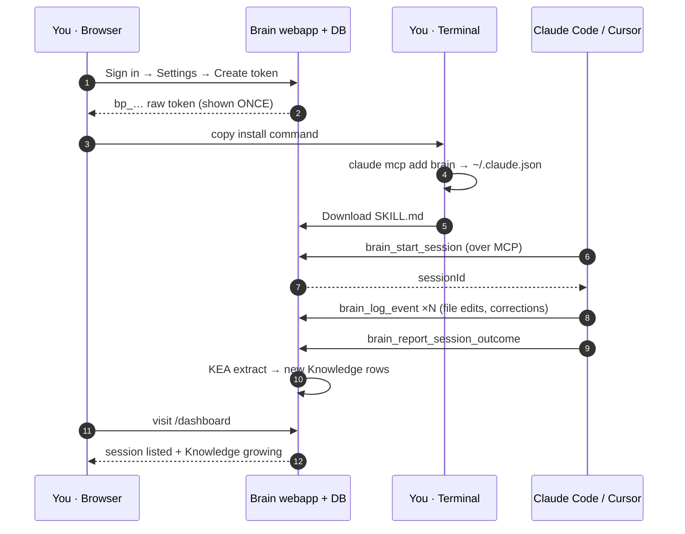

# Tutorial 01 — Getting started

**You'll have:** an MCP-capable AI tool wired to your Brain, a smoke-test
showing the connection works, and the Brain's `SKILL.md` installed so
your tool knows when to call it.

**Time:** ~10 minutes.

**Prerequisites:** a Brain URL (e.g. `https://brain.your-team.com`) and
either an admin account at that URL or an invite link a teammate sent
you.

## What you're wiring up



After the install (steps 1-5 above), every coding session feeds the
Brain automatically. The next sections walk through each of these
steps end-to-end.

---

## Step 1 — Sign in

Open the Brain URL in a browser. You'll see one of three things:

- **Sign-in form** with a username + password field. Use the credentials
  your admin gave you.
- **"Sign in with GitHub"** button. Click it; if your account is in the
  allow-list (admin set this up), you'll be in.
- **Voucher code prompt.** Paste the invite code your teammate sent
  before signing in via GitHub.

After sign-in you'll land on `/dashboard`. It will probably be empty
the first time — that's expected. The dashboard fills in once your AI
tool starts logging sessions.

> **Couldn't sign in?** See [Tutorial 06 — Troubleshooting](./06-troubleshooting.md#cant-sign-in) for the common causes.

## Step 2 — Issue an MCP token

Click **Settings → MCP tokens** in the rail (the leftmost column on
desktop, bottom nav on mobile). Then **Create new token**:

1. **Name** it something memorable that identifies the machine + tool —
   `laptop · claude-code`, `desktop · cursor`. The name only matters
   to you; the Brain logs it on every request so a hygiene-conscious
   operator can revoke a leaked token without affecting others.

2. **Organization scope** (only shown if you're in 2+ orgs): pick the
   org this token can write to. Default is your personal org. Most
   solo users leave it on the default. Team users pick the team org so
   knowledge from this tool lands in the team-shared pool.

3. **Project scope** (only shown if the chosen org has 2+ projects):
   pick a project to restrict the token to that one project, or leave
   blank for "any project the user can access". When set, the token
   refuses to log sessions or teach knowledge against any other
   project — useful for client work where you want to keep context
   isolated.

4. Click **Create**. You'll see a one-time install wizard with a single
   shell command. **Copy it now** — the raw token is shown exactly once
   and is never recoverable. The wizard auto-detects whether you have
   `claude` (Claude Code), `cursor`, or `windsurf` on PATH and tailors
   the command accordingly.

If you closed the wizard before copying, that token is now unusable —
revoke it from the list and create a new one. No data lost; just
inconvenient.

## Step 3 — Install on your machine

Paste the wizard's command into a terminal on the machine where you'll
use your AI tool. Example for Claude Code:

```bash
curl -fsSL https://brain.your-team.com/api/onboard.sh | bash -s 'bp_…your_token_here…'
```

(Audit the script first if you prefer — `curl ... -o /tmp/install.sh`,
read it, then `bash /tmp/install.sh 'bp_…'`. The full audit-first flow
is documented in `../USING_BRAIN.md`.)

The installer:

1. Runs `claude mcp add brain --scope user --transport http <mcp-url> --header "Authorization: Bearer …"`. This adds an entry to your `~/.claude.json` so Claude Code knows there's a Brain MCP server it can call.
2. Downloads `SKILL.md` to `~/.claude/skills/brain/SKILL.md`. The skill file tells Claude Code WHEN to use the Brain — e.g. before starting a coding task, on user corrections, when asking "what do I prefer for X?". Without the skill file, Claude Code knows the Brain exists but won't reach for it on its own.
3. Verifies the install by running `claude mcp list` and looking for a `brain ✓ Connected` line.

If you see `brain · ✗ Failed to connect`, the most common cause is a
DNS / network issue between your machine and the Brain host — see
[Tutorial 06](./06-troubleshooting.md#mcp-connect-failed).

## Step 4 — Smoke-test from your tool

Open Claude Code (or Cursor / Windsurf) in any project directory.
Start a fresh chat and ask:

> *"Use the brain skill to retrieve any knowledge about <something
> you've worked on before>. If nothing matches, say so."*

What you want to see in the model's response:

- **The model calls** `brain_retrieve_knowledge` (you'll see a tool-call
  event in the chat — Claude Code shows these inline; Cursor shows a
  badge).
- **The Brain responds** with either a list of matching rules or an
  empty list saying "no matches".
- **The model summarises** what came back rather than ignoring it.

If the model never calls the brain skill, the `SKILL.md` file isn't
being picked up — usually a path issue. See
[Tutorial 06](./06-troubleshooting.md#tool-doesnt-call-the-brain).

## Step 5 — Open a session and let the Brain learn

Now do a real coding task. Anything works — fix a bug, refactor a
function, build a small feature. The skill instructs your AI tool to:

1. **Open a session** (`brain_start_session`) with a one-line prompt
   describing what you're about to do.
2. **Log events** as it works — file edits, build attempts, your
   corrections, your approvals.
3. **Report the outcome** when the task ends — succeeded / partial /
   failed, plus which files changed.

You don't have to do anything explicit. Just code as normal. After the
task finishes, switch to your browser and visit the Brain's
**Dashboard**:

- **Sessions this week** should now show 1.
- **Recent sessions** at the bottom should list the session you just
  ran with its SQS (session quality score) and outcome.

If you don't see the session, the most common cause is the
`brain_start_session` tool wasn't called. The skill file's job is to
prompt the model to call it; if the model is being terse, you can ask
explicitly: *"start a brain session for this task before proceeding"*.

## Step 6 — Ask the Oracle a question

Visit the Brain's **Oracle** surface (rail item, or hash route
`/#oracle`). The Oracle is the conversational interface to your Brain
— ask anything in natural language, get a cited answer drawn from your
session history and the rules you've taught.

After one session it won't have much to say, but try:

> *"What did I just work on?"*

The Oracle should produce a one-paragraph answer that cites the
session you just ran (the `[^S1]` marker links back to the session
detail). If you ask before the session has been processed (KEA runs in
the background ~30 seconds after the session closes), the Oracle will
honestly say it has no context yet.

---

## What you've achieved

- Your AI tool talks to the Brain over MCP.
- The skill file tells the tool when to use it.
- Your first session is captured + searchable.
- The Oracle can answer questions about your own work.

## Next

- **[Tutorial 02 — Asking the Oracle](./02-asking-the-oracle.md):** how to phrase queries to get useful, grounded answers.
- **[Tutorial 03 — Teaching the Brain](./03-teaching-knowledge.md):** add rules without waiting for sessions to surface them.
