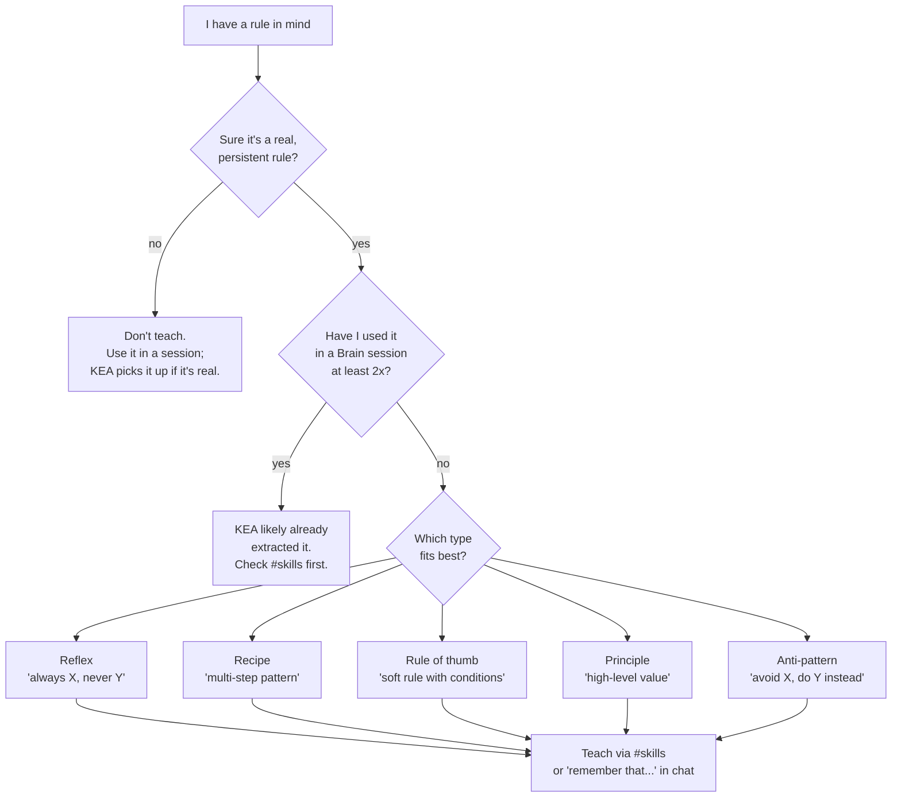

# Tutorial 03 — Teaching the Brain

**You'll have:** a working flow for adding rules directly (without
waiting for KEA to extract them from sessions), an understanding of
the five Knowledge types, and a sense of when to teach vs let the
Brain learn naturally.

**Time:** ~10 minutes.

---

## Two ways the Brain learns

1. **Automatic (KEA — Knowledge Extraction Agent):** runs after every
   session, looks at corrections / approvals / file changes, derives
   rules. You don't do anything; the rules just appear.

2. **Explicit (you teach):** you tell the Brain a rule directly. Used
   when:
   - You already know the rule and don't want to wait for it to surface.
   - It's a rule about a tool / framework you haven't actively used in
     a Brain session yet.
   - KEA missed something obvious and you want to fix that.

Explicit teach gets confidence 1.0 — highest tier — and overrides KEA-
extracted siblings on the same trigger.

## When to teach vs let KEA learn

## The skill types (UI labels & DB enums)

Every rule is categorized into one of five skill types:

| UI Label | DB Enum | What it is | Example |
|---|---|---|---|
| **Reflex** | `reflex` | Unconditional rule for a specific situation | "Always use `useId()` for React form IDs, never `Math.random()`" |
| **Recipe** | `recipe` | Multi-step procedure for a recurring task | "Stripe webhook handler: verify signature, lookup ID, dedup key, return 200" |
| **Rule of thumb** | `heuristic` | Soft default rule that depends on context | "For forms with <5 fields, plain state; otherwise use `react-hook-form`" |
| **Principle** | `principle` | Value-driven approach shaping many choices | "Prefer composition over inheritance in component design" |
| **Anti-pattern** | `anti_principle` | Known bad pattern + what to do instead | "Don't generate IDs client-side at render time; use `useId()` (SSR-safe)" |

*(Note: Settled team choices are saved as **Decisions** — shared across your team and exempt from fading).*

## Two ways to teach: webapp vs MCP

### Option A: webapp (recommended for first time)

Visit [`/#skills`](/#skills) and click **+ Teach**. Fill in:

1. **Type** (dropdown — the five above).
2. **Trigger** (one-line description of when this rule applies). Make
   it specific enough that semantic retrieval on a question like
   "what should I do for X?" will match. Example trigger for the
   `useId` reflex: "React form input id generation".
3. **Rule** (the actual instruction). State it the way you'd want your
   AI tool to read it back to itself before generating code. For
   `anti_principle`s, also fill in **Instead** (what to do instead).
4. **Rationale** (optional but recommended). Why this rule exists. The
   Oracle uses this when answering "why" questions.
5. **Tags** (optional). Comma-separated. Useful for filtering the
   Skills list later — `react`, `forms`, `auth`, etc.
6. **Scope:**
   - `user` — your personal Brain. Default. The rule applies to all
     projects unless you explicitly project-scope it later.
   - `project` — only this project. Use for project-specific
     conventions you don't want bleeding into your other work.
   - `team` / `global` — only relevant in multi-tenant deployments.

Click **Teach** and the rule lands instantly with confidence 1.0.

### Option B: from your AI tool, mid-session

Inside Claude Code / Cursor / Windsurf, just say it to the model — no
special syntax, the phrasing shapes the type:

| Say… | Lands as… |
|---|---|
| "always use `useId()` for form ids, never `Math.random()`" | `reflex` |
| "for forms with 3+ fields use react-hook-form + zod, not Formik" | `heuristic` |
| "we decided to use Redis for session storage, not Postgres" | project `decision` |
| "no — that check moved to the route handler last month" | correction, mid-session |

The model calls `brain_teach_knowledge` and the rule lands the same way
as the webapp form. This is the natural flow when you're mid-task and
want to capture something without context-switching to a browser.

The model is usually accurate at picking the type (`reflex` vs
`heuristic` vs `principle`). If you notice it picked the wrong type,
you can edit the row from [`/#skills`](/#skills) afterwards.

## When NOT to teach

The Brain should accumulate evidence; explicit teach should be the
exception, not the rule. Don't teach:

- **Ad-hoc preferences** that change weekly. Those are noise; let KEA
  extract the patterns that actually persist.
- **One-off solutions** to a specific bug. Not a rule.
- **Things you're guessing at.** A rule taught with low conviction at
  confidence 1.0 will out-rank KEA-extracted contradictory rules at
  confidence 0.7, and stay over-ranked until you delete it.

If you're not sure: don't teach. The session-based flow is what makes
the Brain self-improving over time.

## Editing + forking taught rules

Knowledge rows are semantically immutable (KNOWLEDGE.md §5.1 — once
created, the trigger / rule / rationale don't change). To revise a
rule:

- **Fork it** — [`/#skills`](/#skills) → click the row → **Fork**. Creates a child
  Knowledge row with the new text and a `parentKnowledgeId` link back
  to the original. The original gets marked as superseded.
- The Oracle prefers the fork over the parent on retrieval (newer,
  higher confidence wins ties).

Editing metadata (tags, scope, confidence) IS allowed. Editing the
trigger / rule / rationale forces the fork flow.

## Soft-deleting rules you no longer want

Rules that turned out wrong or stopped applying: click the row → 
**Delete**. This soft-deletes (sets `deletedAt` on the row) so the
audit trail survives but retrieval skips it.

Soft-deleted rules don't count toward your Knowledge total on the
dashboard; they don't appear in the Oracle's context.

## Next

- **[Tutorial 07 — Skill types, explained](./07-skill-types-explained.md):** what Recipe / Rule of thumb / Principle / Reflex / Anti-pattern / Decisions actually mean, in plain language with everyday examples — the deep version of the type table above.
- **[Tutorial 04 — Token scope + management](./04-managing-tokens.md):** scope a token to a single project so a contractor / temporary team member only sees the relevant slice of your Brain.
- **[Tutorial 05 — Exporting rules](./05-exporting-rules.md):** drop your accumulated rules into a project's `.claude/` / `.cursor/` / `AGENTS.md`.
