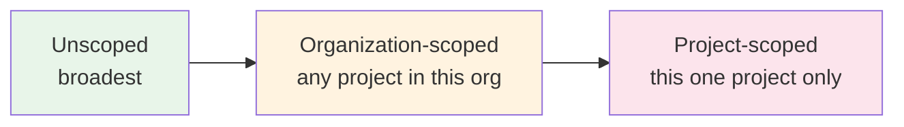
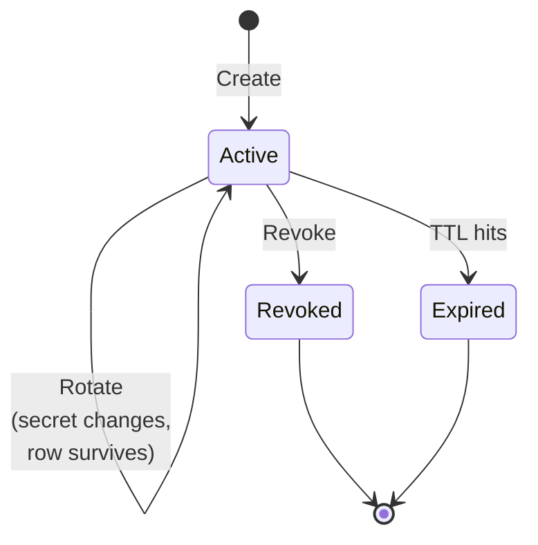

# Tutorial 04 — Token scope + management

**You'll have:** an understanding of MCP tokens, project + organization
scoping, rotation vs revocation, and the typical patterns for
multi-machine + team-shared deployments.

**Time:** ~10 minutes.

---

## What an MCP token is

A bearer token (`bp_…`) that authenticates one MCP client (one tool on
one machine) to your Brain. Tokens:

- **Are issued by you**, from [`/settings/tokens`](/settings/tokens) in the webapp.
- **Live only in `~/.claude.json`** (or the equivalent for Cursor /
  Windsurf) on the machine that uses them — never on the Brain server
  except as a SHA-256 hash.
- **Are shown exactly once** at creation; lose it = revoke + reissue.
- **Are bound to a single user** (you), but can be **scoped** down
  further to a single org or project.

## The scope hierarchy



| Scope | Token can act on | Use when |
|---|---|---|
| Unscoped | Any org/project the user belongs to | Solo user with one Brain |
| Org-scoped | Any project in the chosen org | One token per org boundary |
| Project-scoped | One specific project within the chosen org | Contractor / client work |

When the Brain receives a request, it enforces the scope:

- Trying to log a session against a project the token can't see
  returns `FORBIDDEN_PROJECT`.
- Trying to teach Knowledge tagged to a foreign project returns the
  same.
- Trying to read Knowledge from a project the token can't see returns
  an empty result (not 403 — the Brain doesn't leak the existence of
  resources you can't access).

## When to scope

| Scenario | Recommended scope |
|---|---|
| Solo user, single Brain across all your code | Unscoped |
| You belong to your personal org + a team org, want one token for "personal coding only" | Org-scoped to personal |
| You're working on a client project + don't want client knowledge bleeding into your other repos | Project-scoped to the client project |
| You're handing a token to a contractor for a single project | Project-scoped (mandatory) |

## Creating a scoped token

1. [`/settings/tokens`](/settings/tokens) → **Create new token**.
2. **Name** the token (e.g. `laptop · client-acme`).
3. **Organization scope** — picker shown if you're in 2+ orgs:
   - "Any (your personal org)" — token belongs to your personal org.
   - Or pick a specific org from the list.
4. **Project scope** — picker shown when the chosen org has 2+
   projects:
   - "Any project" — token can act on any project in the chosen org.
   - Or pick a specific project to lock the token down further.
5. **Create** → install wizard pops up with the one-line command. Copy
   it before closing the wizard.

The chosen scope is shown as chips on the token row in the list (e.g.
`Org: Acme` + `Project: brain-platform`). If you didn't set an org
scope, no org chip is shown (the personal-org default is implied).

## Changing scope on an existing token (in-place)

Recently added — you no longer have to revoke + reissue to change
scope. Click the **Scope** button on a token row to open the scope
modal. Same pickers as creation. Save and the change takes effect on
the next request the token makes; the secret stays the same so
clients keep working without re-pasting.

The change is audit-logged (`token.scope_change`) with before/after
values, so an admin can reconstruct the history.

## Token lifecycle



A token enters at **Active** on creation; can take any of three
in-place transitions (rotate, scope-change, expire); revocation is
terminal.

## Rotation vs revocation

**Rotate** (the **Rotate** button): the token's secret changes; old
secret stops working immediately. The token row itself stays — same
id, same name, same scope, just a new secret. Clients have to be
re-installed (the install command from the post-rotation wizard).

Use rotate when:
- A token has been in use for a long time and you want hygiene
  rotation.
- You suspect a leak but the leak isn't confirmed (otherwise revoke).

**Revoke** (the **Revoke** button): the token row is marked revoked.
All future requests with that secret fail. The row stays in the list
(grayed out) for audit purposes but cannot be reactivated.

Use revoke when:
- The token leaked.
- The machine the token lives on is decommissioned.
- The contractor / team member no longer needs access.

## Verifying the connection works

Two surfaces let you confirm — without leaving the webapp — that your
machine is actually talking to the Brain and that knowledge is flowing
in.

### Home dashboard → Connection status card

The first card on the home dashboard polls every 10 seconds and shows:

- **Per-token heartbeat.** Each active token gets a row with a dot
  (green = used in the last 5 min, grey = idle) and a relative
  timestamp. If your `laptop · claude-code` token shows green and
  "12s ago", a session from that machine just hit the Brain.
- **24h knowledge-flow counters.** Sessions started, events
  ingested, Knowledge items extracted. Numbers > 0 prove that
  knowledge is being captured, not just that auth is working.
- **KEA queue depth.** Pending `kea.extract` jobs in pg-boss. A
  steady non-zero number means the worker isn't draining — usually
  a problem with the worker container, not your client.

If the card shows your token grey ("never used" or "3d ago") even
though you just ran a session, the call never reached the Brain.
Jump to the next section.

### [`/settings/tokens`](/settings/tokens) → Verify button

Every active token has a **Verify** button that hits the server with
its row id. It returns one of:

- `✓ Token is active — checked just now` — the token row exists,
  isn't revoked, isn't expired. Nothing wrong server-side.
- `✗ revoked` / `✗ expired` — the token row has been disabled.
  Issue a new one and re-paste the install snippet.

**What Verify does NOT prove:** that your *machine* can reach the
Brain. The button calls from your browser, not from your terminal.
For end-to-end, watch the Connection status card while you trigger a
session from Claude Code / Cursor — the token's dot should flip
green within a few seconds.

### CLI fallback

If you'd rather verify from a shell:

```bash
# Should be 401 (auth gate works) and 200 with a token (yours works).
curl -s -o /dev/null -w "%{http_code}\n" \
     -X POST https://YOUR-BRAIN/mcp \
     -H 'Content-Type: application/json' \
     -H 'Accept: application/json, text/event-stream' \
     -H "Authorization: Bearer $YOUR_TOKEN" \
     -d '{"jsonrpc":"2.0","id":1,"method":"initialize","params":{"protocolVersion":"2024-11-05","capabilities":{},"clientInfo":{"name":"x","version":"1"}}}'
```

200 = your machine + token + network all work. 401 = token rejected.
Anything else = network / proxy issue.

## Multi-machine setup

The cleanest pattern: one token per (machine × tool). Naming
convention `<machine> · <tool>` (e.g. `laptop · claude-code`,
`desktop · cursor`).

Why per-machine vs sharing one token across machines:
- Revoking a leaked token only impacts the affected machine.
- The `lastUsedAt` field on each token row tells you when each
  installation was last active — useful for figuring out which one to
  revoke when you decommission a machine.

## Team / shared-Brain pattern

For a team Brain (multiple users sharing one Brain instance):

1. Each user gets their own account on the Brain (admin invites or
   voucher codes).
2. Each user issues their own tokens — they're per-user; you can't
   "share a token" across users.
3. To collaborate on knowledge, all team members issue tokens scoped
   to the **team org** (rather than personal). Knowledge taught from
   those tokens lands in the team-shared pool.

If a contractor joins for one project:

1. Admin invites them; voucher code lands in their email.
2. Contractor signs in.
3. Contractor creates a token **project-scoped** to the client project.
4. Contractor's MCP traffic is fully boxed: they can read/write
   knowledge for that project only.

## Inspecting + auditing

[`/settings/tokens`](/settings/tokens) shows every active + revoked token: name, scope
chips, created date, last-used date. The admin ([`/admin/audit`](/admin/audit)) can
see every `token.create`, `token.revoke`, `token.change`, and
`token.scope_change` event with the actor, timestamp, IP, and
user-agent.

## Common mistakes

- **Pasting the token into a chat / commit / Slack DM.** Tokens are
  unique secrets; if it landed somewhere it shouldn't, revoke it now.
  The audit log will show every request the leaked token made.
- **Sharing a token between users.** The Brain logs all activity to
  the token's owner. Two users sharing one token will see each
  other's session histories in the dashboard. Always issue per-user.
- **Setting `ttlDays: 0` on creation** (no expiry). The webapp's
  default TTL is 90 days — fine for most cases. Indefinite-lifetime
  tokens are an audit footgun; set an expiry unless you have a real
  reason not to.

## Next

- **[Tutorial 05 — Exporting rules](./05-exporting-rules.md):** with token + Brain wired up, dump your accumulated rules into a project's local `.claude/` or `.cursor/` directory.
- **[Tutorial 06 — Troubleshooting](./06-troubleshooting.md):** if a tool says "MCP brain failed to connect", start here.
