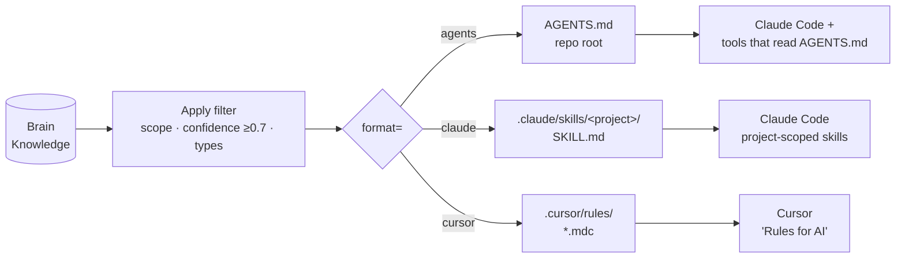

# Tutorial 05 — Exporting rules

**You'll have:** your accumulated Knowledge dropped into a project's
local `.claude/`, `.cursor/rules/`, or `AGENTS.md` so even tools that
DON'T support MCP can benefit from your Brain.

**Time:** ~5 minutes.

---

## Why export

The Brain's primary value is the live MCP loop — your tool talks to
the Brain at session time and pulls in the right rules. But:

- **You're starting a new project** and want a head-start with the
  rules you already have.
- **You're using a tool that doesn't support MCP** (a code review bot,
  a git hook, a custom tool that reads `AGENTS.md`).
- **You're handing off a project** to someone who doesn't have access
  to your Brain.

For all three, exporting your rules as a static file gives you a
useful subset without the live loop.

## What gets exported

The exporter walks your Knowledge with these defaults:

- **Scope filter:** rules tagged `user` or `project` (matching the
  active project). Team / global rules are skipped — they belong to a
  different surface.
- **Confidence floor:** ≥ 0.7. Lower-confidence rules are noisy in a
  static file.
- **Type filter:** all five types (`reflex`, `recipe`, `heuristic`,
  `principle`, `anti_principle`).
- **Outcome filter:** rules with measured low effectiveness
  (`successCount` low + flagged) are skipped.

You can override each on the export form.

## Three formats



| Format | Where it lives | Used by |
|---|---|---|
| `AGENTS.md` | Repo root | Claude Code (built-in), some other agentic tools that read top-level conventions |
| `.claude/skills/<project>/SKILL.md` | Repo `.claude/` | Claude Code project-scoped skills |
| `.cursor/rules/*.mdc` | Repo `.cursor/` | Cursor's "rules for AI" |

The exporter generates the same content for all three, formatted to
each tool's conventions.

## How to export

### From the webapp

`/skills` → top-right toolbar → **Export rules**. Pick:

1. **Format** (AGENTS.md / claude / cursor).
2. **Scope** (user only, project only, both).
3. **Confidence floor** (default 0.7).

Click **Generate**. You'll get a downloadable file. Drop it into the
target project's repo at the path the modal shows.

### From the REST API

If you want to script exports (e.g. as part of a CI step that updates
a project's `AGENTS.md` weekly), hit:

```bash
curl -H "Authorization: Bearer bp_…" \
     "https://brain.your-team.com/api/export/rules?format=agents&scope=project"
```

Returns the formatted file body. Pipe to `> AGENTS.md` and commit.

Available formats: `agents`, `claude`, `cursor`.

## Keeping the export fresh

The exported file is a snapshot — it doesn't update automatically.
For projects under active development, two patterns work:

**Manual refresh.** Re-run the export weekly / before a major commit.
Diff against the existing file to see what's new.

**Scripted refresh.** Add a CI job that runs the curl command above
weekly and opens a PR if the file changed. Example for GitHub Actions:

```yaml
name: Refresh AGENTS.md from Brain
on:
  schedule:
    - cron: '0 8 * * 1'      # 8am Monday
  workflow_dispatch:
jobs:
  refresh:
    runs-on: ubuntu-latest
    steps:
      - uses: actions/checkout@v4
      - name: Fetch latest rules
        run: |
          curl -fsSL -H "Authorization: Bearer ${{ secrets.BRAIN_TOKEN }}" \
            "${{ secrets.BRAIN_URL }}/api/export/rules?format=agents&scope=project" \
            > AGENTS.md
      - name: Open PR if changed
        uses: peter-evans/create-pull-request@v6
        with:
          title: 'chore: refresh AGENTS.md from Brain'
          commit-message: 'chore: refresh AGENTS.md from Brain'
          branch: brain-refresh-agents
```

## Sanity-checking what you exported

Open the generated file. Each rule should be one short paragraph (or
list item). The Brain inserts the trigger as a heading + the rule as
the body, with rationale as a sub-bullet.

If you see a rule that doesn't apply to this project, the export
filter was too loose — re-export with stricter scope or confidence
floor, or fork-and-soft-delete the offending Knowledge row in the
Brain.

If you see contradictory rules ("always use formik" + "never use
formik"), KEA hasn't fully consolidated yet — visit `/#skills`,
review the contradicting rows, and resolve via fork or delete.

## Importing rules into the Brain

Going the other way is also supported, though less common:

```bash
curl -X POST -H "Authorization: Bearer bp_…" \
     -H "Content-Type: application/json" \
     -d @rules.jsonl \
     "https://brain.your-team.com/api/import/rules"
```

Each line in `rules.jsonl` is a Knowledge row with `type`, `triggerText`,
`ruleText`, etc. Useful when migrating from another rules system or
seeding a fresh Brain with a corpus of known rules.

## Next

- **[Tutorial 06 — Troubleshooting](./06-troubleshooting.md):** the most common end-user issues and how to fix them.
